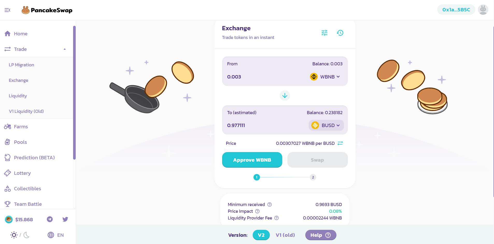
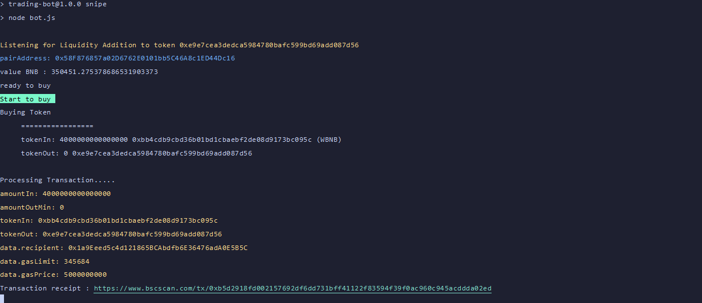

# Sample Pancakeswap Bot - Status: Not Ready - Under Development

A sample bot based on NodeJS for automating pancakeswap transactions.

## DISCLAIMER

This project is free and is built by referencing other existing open source repositories for educational and demonstrational purposes only. Use at your own risk! The developer is not responsible for any consequences araised by the usage of this software. User descrition is adviced.

# Table of contents

- [Features](#FEATURES)
- [Usage](#USAGE)
- [Troubleshoot](#TROUBLESHOOT)

## Features

1. Buy token with custom gas fee, slippage, amount.<br>
2. Sell bought token with custom gas fee, slippage, amount.

## Usage

0. Install NodeJS v14+.
1. Clone this repository and switch to the folder.
2. Run `npm install`.
3. Rename `.env.example`to `.env`.
4. Setup the required values in `.env` file.
5. Approve your WBNB on pancakeswap.
   <br><br>
   
6. Run `npm run buy` to buy.
7. Wait the bot do his job, if success, you will see like this picture.
   <br><br>
   
8. Approve your coin for swapping on pancake.
9. Run `npm run sell` to sell.
10. Close the bot with `ctrl + c`.

### Reference for `.env`.

```

WBNB_CONTRACT=0xbb4cdb9cbd36b01bd1cbaebf2de08d9173bc095c
~ WBNB contract for buy the token

FACTORY=0xcA143Ce32Fe78f1f7019d7d551a6402fC5350c73
~ Pancake Factory contract to get function of buy

ROUTER=0x10ED43C718714eb63d5aA57B78B54704E256024E
~ Pancake Factory contract to process function of buy


YOUR_ADDRESS=
~ Your BSC (BEP20) address from trustwallet or another wallet.


YOUR_MNEMONIC=
~ Input your private Key here, that you get from your wallet privacy.


MIN_LIQUIDITY_ADDED=3
~ Set how much minimum liquidity added in pair address that you want to buy. set in BNB. (eg : 2, 4, 7).
  2 mean 2 BNB liquidity added.

TO_PURCHASE=0xe9e7cea3dedca5984780bafc599bd69add087d56
~ Token address that you want to buy.


SLIPPAGE=1
~ Customize your slippage here, cannot decimal. (eg : 1, 5, 10). if you buy early token recommended 30+ Slippage

GWEI=5
~ Customize your GWEI (gas fee) here, cannot decimal. (eg : 5, 10, 25). if you buy early token recommended 15+ GWEI

GAS_LIMIT=345684
~ Minimul limit is 210000, more the better.

AMOUNT_OF_WBNB=0.002
~ Amount how much you want buy the token in WBNB.


SELL_SLIPPAGE=1
~ Customize your slippage here for selling, cannot decimal. (eg : 1, 5, 10). if you buy early token recommended 30+ Slippage

SELL_GWEI=5
~ Customize your GWEI (gas fee) here for selling, cannot decimal. (eg : 5, 10, 25). if you buy early token recommended 15+ GWEI

SELL_GAS_LIMIT=345684
~ Gas limit for selling. Minimul limit is 210000.

SELL_AMOUNT_OF_COIN=0.002
~ Amount how much you want sell the token for in WBNB.

```

## TROUBLESHOOT

These are some reasons for your txn to fail:
<br>

- You haven't approved your WBNB/Token.
- Your gas limit is too small.
- Your gas price is too small.
- Your slippage is too small.

## Footnotes

Fairly new the the crypto game. Please share any feedbacks or report bugs using the issues section.

### References

- [Nafidinara](https://github.com/Nafidinara/bot-pancakeswap)<br>
- [MrFatoni](https://github.com/MrFatoni/pancakeswap-sniping-bot)<br>

### Donations

Like what you see? Need improvements?<br>
Show your support, buy me a coffee as BNB @ `0xd304cE8b03ee843Da6517Ceedb72E80785F7094F`.<br>
Pull requests are welcomed!
